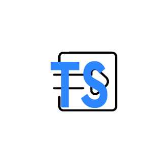
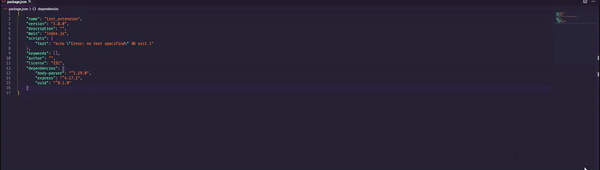

# ts-autotypes

ts-autotype is a vscode extension that will allow you automatically import every @types dependencies in your typescript project using npm or yarn

## Features

In order to auto import your types search for the command "Auto import types with npm/yarn", then wait for installation.

All dependencies and dev dependencies include in your **package.json** will be scan to see if a @types dependency exist and will install it. 

**Make sure that you have a package.json file at the root of your project**

## Release Notes

Users appreciate release notes as you update your extension.

### 1.0.0

**First version of the extension**

features:

- Import types with **npm**
- Import types with **yarn**

-----------------------------------------------------------------------------------------------------------

## Contributing 

All contributions are welcomed, since it's my first vscode extension I guess it's not perfect :stuck_out_tongue:.

